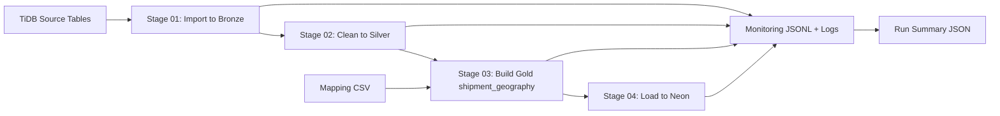

# Logistics Shipment Geography ETL Pipeline


## Overview
A production-style ETL project that builds a clean `shipment_geography` analytics table from normalized logistics source tables.

This project demonstrates:
- Enterprise ETL layering (Bronze, Silver, Gold)
- Source-to-target mapping driven transformation
- Automated end-to-end orchestration
- Data quality checks and monitoring artifacts
- Full refresh load into Neon PostgreSQL

## Business Value
In logistics systems, shipment data is usually spread across many normalized tables (`shipment`, `office`, `pin_code`, `city`, `state`, `region`, `country`, etc.).

This pipeline creates a viewer-friendly geography output (`shipment_geography`) that is ready for:
- BI dashboards
- Shipment trend analysis by city/state/region/country
- Reporting and downstream analytics workloads

## Architecture


## ETL Workflow
| Stage | Script | Purpose | Key Output |
|---|---|---|---|
| 01 | `01_import_to_bronze.py` | Extract source tables from TiDB into Parquet | Bronze layer Parquet files |
| 02 | `02_silver.py` | Clean text values, normalize empty strings | Silver layer Parquet files |
| 03 | `03_gold.py` | Join mapped tables and build final dataset | `shipment_geography.parquet` |
| 04 | `04_load_neon.py` | Validate target, truncate, reload data | `public.shipment_geography` in Neon |
| Orchestrator | `run_pipeline.py` | Run stages in order (full/partial) | Consolidated run summary |

## Mapping Strategy
Primary mapping contract:
- [mappings/shipment_geography_mapping.csv](mappings/shipment_geography_mapping.csv)

Transformation style:
- Direct mapping for `shipment_id`
- Lookup chain for hierarchy fields:
  - shipment -> office -> pin_code -> city -> zone/state -> region -> country

## Enterprise Features Implemented
### Reliability
- Retry support for transient DB operations
- Strict mode quality gates
- Safe stage failure tracking with run id

### Data Quality
- Source table availability checks
- Bronze-to-Silver row count checks
- Gold column contract checks from mapping
- `shipment_id` null check
- `shipment_id` duplicate check
- Post-load row count validation

### Monitoring
Per run id, the pipeline generates:
- `{run_id}_stage_metrics.jsonl`
- `{run_id}_data_quality_checks.jsonl`
- `{run_id}_run_summary.json`

Location:
- [Shipment_Geography_ETL_Pipeline/logs](Shipment_Geography_ETL_Pipeline/logs)

## Execution Proof (Validated Run)
Reference run summary:
- [Shipment_Geography_ETL_Pipeline/logs/sg_20261001T070715Z_56edddc9_run_summary.json](Shipment_Geography_ETL_Pipeline/logs/sg_20261001T070715Z_56edddc9_run_summary.json)

Key results:
| Metric | Value |
|---|---|
| Run Status | success |
| Total Stages | 4 |
| Checks Passed | 24 |
| Checks Failed | 0 |
| Gold Rows Built | 100000 |
| Neon Rows Loaded | 100000 |

## Project Structure
```text
L&T_ETL_Project/
|- README.md
|- requirements.txt
|- .env
|- mappings/
|  |- shipment_geography_mapping.csv
|- Shipment_Geography_ETL_Pipeline/
|  |- README.md
|  |- logs/
|  |- parquet/
|  |  |- bronze/
|  |  |- silver/
|  |  |- gold/
|  |- scripts/
|     |- sg_common.py
|     |- 01_import_to_bronze.py
|     |- 02_silver.py
|     |- 03_gold.py
|     |- 04_load_neon.py
|     |- run_pipeline.py
```

## Quick Start
### 1) Install dependencies
```powershell
pip install -r .\requirements.txt
```

### 2) Run full ETL
```powershell
.\myenv\Scripts\python.exe .\Shipment_Geography_ETL_Pipeline\scripts\run_pipeline.py
```

### 3) Run partial ETL (example: silver to load)
```powershell
.\myenv\Scripts\python.exe .\Shipment_Geography_ETL_Pipeline\scripts\run_pipeline.py --from-stage 02 --to-stage 04
```

## Tech Stack
- Python 3.13
- Pandas
- SQLAlchemy
- PyMySQL (source)
- psycopg2 (target)
- Parquet + PyArrow
- Neon PostgreSQL

## Portfolio Highlights
- Designed and implemented a layered ETL system with production-style controls
- Converted normalized source model into analytics-friendly dimensional output
- Added robust logging, monitoring, and quality validations
- Validated end-to-end run with 100k row load into cloud PostgreSQL target
